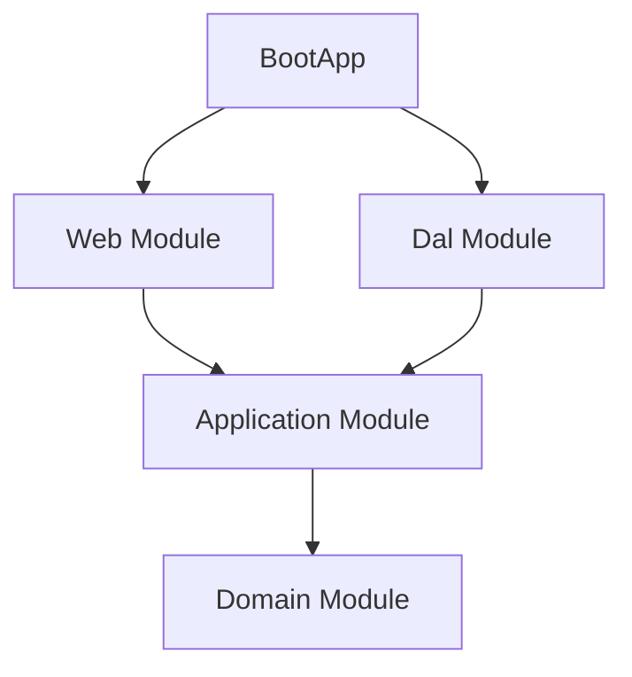

# BoardBuddy

BoardBuddy helps board‑game players create groups for their sessions and, inside each group, record wins/losses and scoreboards, and view player rankings over time. The goal is to make it easy to organize meetups, keep track of results, and surface competitive standings.

## Architecture at a Glance

### Module Topology


## Run Locally

- Build
```bash
./gradlew clean build
```

- Run (bootstrap module)
```bash
./gradlew :bootstrap:bootRun
```

Default port: http://localhost:8080
