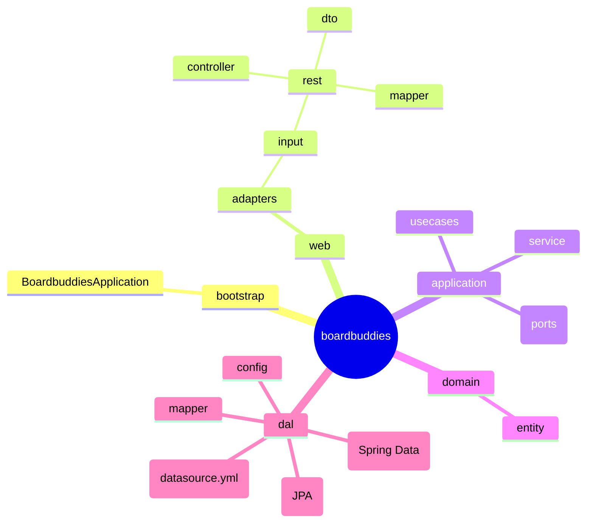
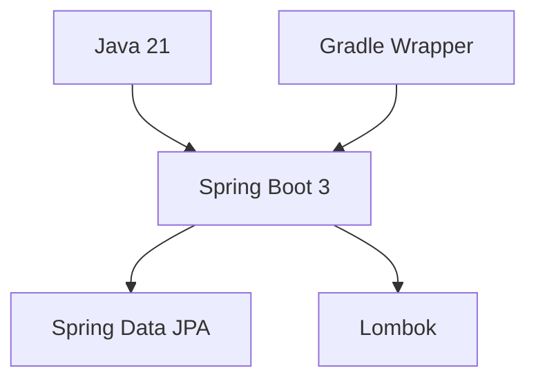

# BoardBuddies

A small multi-module Spring Boot project for board game user management, organized with a ports-and-adapters (hexagonal) architecture.

## Project Description
BoardBuddies helps board‑game players create groups for their sessions and, inside each group, record wins/losses and scoreboards, and view player rankings over time. The goal is to make it easy to organize meetups, keep track of results, and surface competitive standings.

This README intentionally focuses on a visual overview and local execution only.

## Architecture at a Glance

### Module Topology
```mermaid
flowchart LR
    subgraph Web [web]
      C[REST Controllers]\nDTO/Mapper
    end
    subgraph Application [application]
      U[Use Cases]\nServices
    end
    subgraph Domain [domain]
      D[Domain Entities]\nPorts
    end
    subgraph DAL [dal]
      R[Persistence Adapter]\nJPA Repositories
    end
    subgraph Bootstrap [bootstrap]
      B[App Entry Point]
    end

    C --> U
    U --> D
    U --> R
    R --> D
    B --> C
```

### Project Structure (Modules)


### Technology Stack (Overview)


Note: Concrete APIs, detailed requirements, and configuration how-tos are intentionally omitted as they evolve over time.

## Run Locally

- Build
```bash
./gradlew clean build
```

- Run (bootstrap module)
```bash
./gradlew :bootstrap:bootRun
```

Default port: http://localhost:8080
